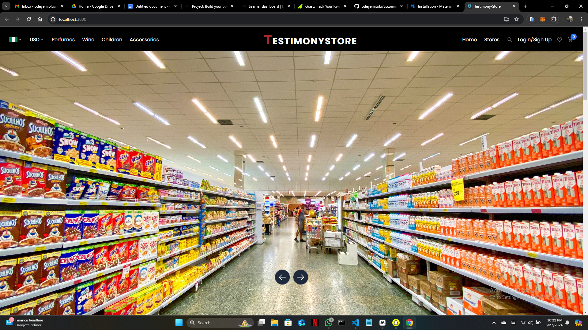

# Ecommerce Stores

# Images

## Table of Contents
- [About](#about)
- [Features](#features)
- [Tech Stack](#tech-stack)
- [Getting Started](#getting-started)
  - [Prerequisites](#prerequisites)
  - [Installation](#installation)
- [Usage](#usage)
- [API Documentation](#api-documentation)
- [Contributing](#contributing)
- [License](#license)
- [Contact](#contact)

## About

Testimony Stores is a revolutionary e-commerce platform designed to provide a unified shopping experience. Our mission is to simplify online shopping by offering a wide range of products backed by genuine user testimonials, all in one place.

## Features

- **Unified Shopping Experience**: Browse and purchase products across multiple categories in a single platform.
- **User Testimonials**: Make informed decisions with authentic reviews from real users.
- **Smart Recommendations**: Discover products tailored to your preferences using our AI-powered recommendation engine.
- **Advanced Search**: Find exactly what you're looking for with our Elasticsearch-powered search functionality.
- **Secure Transactions**: Shop with confidence using our PCI-compliant payment processing system.
- **Responsive Design**: Enjoy a seamless shopping experience across all devices.

## Tech Stack

- Frontend: React.js, Next.js
- Backend: Python, Flask
- Database: MySQL

## Getting Started

### Installation

1. Clone the repository:
git clone https://github.com/odeyemitobi/Eccomerce-Store.git
2. Navigate to the project directory:
cd Eccomerce-Store
3. Install dependencies:
npm i

## Usage

After starting the development server, open your browser and navigate to `http://localhost:3000` to access the Testimony Stores application.

## Contributing

We welcome contributions to Testimony Stores! Please read our [Contributing Guidelines](CONTRIBUTING.md) for details on our code of conduct and the process for submitting pull requests.

## License

This project is licensed under the MIT License - see the [LICENSE](LICENSE) file for details.

## Contact

If you have any questions, feel free to reach out:

- My Name- Odeyemi Tobiloba
- My Email- (odeyemioluwatobiloba11@gmail.com)
- Project Link: (https://github.com/odeyemitobi/Eccomerce-Store)